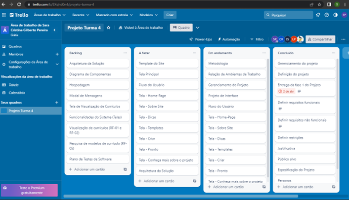

# Metodologia

A metodologia contempla as ferramentas utilizadas pela equipe tanto para a manutenção dos códigos e demais artefatos quanto para a organização do time na execução das tarefas do projeto. Entre essas ferramentas que serão utilizadas, estão o GitHub, para o repositório do código fonte, o Google Drive para a organização da documentação do projeto, o MarvelApp para a produção de projetos e protótipos de interfaces e wireframes e o uso do Trello para o gerenciamento do projeto. 

Relação de Ambientes de Trabalho 

Os dispositivos do projeto são desenvolvidos a partir de algumas plataformas e a relação dos ambientes com seu respectivo propósito é apresentada na tabela que se segue.  

|Ambiente                      | Plataforma         | Link de Acesso| 
|------------------------------|--------------------|---------------------------------------------------------------------------------------|
|Repositório de código fonte   | GitHub             | https://github.com/orgs/ICEI-PUC-Minas-PMV-ADS/teams/pmv-ads-2023-1-e1-proj-web-t3-g4 |  
|Documentos do projeto         | Microsoft Teams    | https://sgapucminasbr-my.sharepoint.com/:w:/g/personal/1465315_sga_pucminas_br/EVz-sKzi9khPv8ge9o20dJMBSh2OrBplSZih9pX_QxTtcw|                     |
|Projeto de Interface e Wireframes|         MarvelApp          | https://marvelapp.com/prototype/6af43e5/screen/91276406|
|Gerenciamento do Projeto      | Trello             | https://trello.com/b/BXqhd0n4/projeto-turma-4|  

 

## Controle de Versão

A ferramenta de controle de versão adotada no projeto foi o
[Git](https://git-scm.com/), sendo que o [Github](https://github.com)
foi utilizado para hospedagem do repositório.

O projeto segue a seguinte convenção para o nome de branches:

- `main`: versão estável já testada do software
- `unstable`: versão já testada do software, porém instável
- `testing`: versão em testes do software
- `dev`: versão de desenvolvimento do software

Quanto à gerência de issues, o projeto adota a seguinte convenção para
etiquetas:

- `documentation`: melhorias ou acréscimos à documentação
- `bug`: uma funcionalidade encontra-se com problemas
- `enhancement`: uma funcionalidade precisa ser melhorada
- `feature`: uma nova funcionalidade precisa ser introduzida

Discuta como a configuração do projeto foi feita na ferramenta de versionamento escolhida. Exponha como a gerência de tags, merges, commits e branchs é realizada. Discuta como a gerência de issues foi realizada.

> **Links Úteis**:
> - [Tutorial GitHub](https://guides.github.com/activities/hello-world/)
> - [Git e Github](https://www.youtube.com/playlist?list=PLHz_AreHm4dm7ZULPAmadvNhH6vk9oNZA)
>  - [Comparando fluxos de trabalho](https://www.atlassian.com/br/git/tutorials/comparing-workflows)
> - [Understanding the GitHub flow](https://guides.github.com/introduction/flow/)
> - [The gitflow workflow - in less than 5 mins](https://www.youtube.com/watch?v=1SXpE08hvGs)

## Gerenciamento de Projeto

### Divisão de Papéis

A equipe utiliza metodologias ágeis, tendo escolhido o Scrum como base para definição do processo de desenvolvimento. 

A equipe está organizada da seguinte maneira: 

Scrum Master:  

     - Sara Cristina  

Product Owner:  

     - Israel Cunha 

Equipe de Desenvolvimento: 

     - Thais Figueiredo 

     - Leonardo Júnio 

     - Bernardo Morais  

     - Sara Cristina  

     - Israel Cunha 

     - Caio Augusto 

     - Mario Jose  

Equipe de Design: 

     - Caio Augusto 

     - Mario Jose  

### Processo

Para organização e distribuição das tarefas do projeto, a equipe está utilizando o app Trello estruturado com as seguintes listas:  

Figura 1 - O quadro Kanban (Figura 1) do grupo desenvolvido na ferramenta de gerenciamento de projetos está disponível através da URL https://trello.com/b/BXqhd0n4/projeto-turma-4 e é apresentado, no estado atual.

- A fazer: recebe as tarefas a serem trabalhadas e representa o Product Backlog. Todas as atividades identificadas no decorrer do projeto também devem ser incorporadas a esta lista. 

- Em Andamento: Esta lista representa o Sprint Backlog. Este é o Sprint atual que estamos trabalhando. 

- Concluído: nesta lista são colocadas as tarefas finalizadas e passarão pelos testes e controle de qualidade. 

### Ferramentas

As ferramentas empregadas no projeto são:

- Editor de código - VS CODE, GitHub
- Ferramentas de comunicação - Trello, GitHub
- Ferramentas de desenho de tela - Marvel App

O editor de código foi escolhido porque ele possui uma integração com o
sistema de versão. As ferramentas de comunicação utilizadas possuem
integração semelhante e por isso foram selecionadas. Por fim, para criar
diagramas utilizamos essa ferramenta por melhor captar as
necessidades da nossa solução.

Liste quais ferramentas foram empregadas no desenvolvimento do projeto, justificando a escolha delas, sempre que possível.
 
> **Possíveis Ferramentas que auxiliarão no gerenciamento**: 
> - [Github](https://github.com/)
> - [trello](https://trello.com/)
