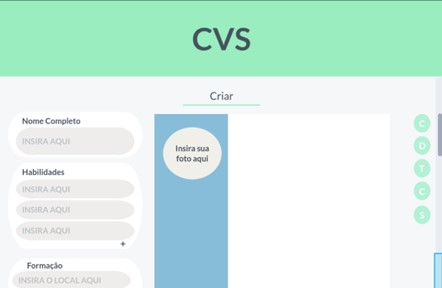

# Projeto de Interface

Pré-requisitos: <a href="2-Especificação do Projeto.md"> Documentação de Especificação</a>

Visão geral da interação do usuário pelas telas do sistema e protótipo interativo das telas com as funcionalidades que fazem parte do sistema (wireframes).

 Apresente as principais interfaces da plataforma. Discuta como ela foi elaborada de forma a atender os requisitos funcionais, não funcionais e histórias de usuário abordados nas <a href="2-Especificação do Projeto.md"> Documentação de Especificação</a>.

## User Flow

Figura 2 - UserFlow

Fluxo de usuário (User Flow) é uma técnica que permite ao desenvolvedor mapear todo fluxo de telas do site ou app. Essa técnica funciona para alinhar os caminhos e as possíveis ações que o usuário pode fazer junto com os membros de sua equipe.

## Wireframes

Conforme fluxo de telas do projeto, apresentado no item anterior, as telas do sistema são apresentadas em detalhes nos itens que se seguem. As telas do sistema apresentam uma estrutura comum que é apresentada na Figura 3 Nesta estrutura, existem 3 grandes blocos, descritos a seguir. São eles:
●	Cabeçalho - local onde são dispostos elementos fixos de identidade (logo);
●	Conteúdo - apresenta o conteúdo da tela em questão;
●	Barra lateral direita - apresenta o menu principal de navegação entre as páginas.

Figura 3 – Estrutura padrão do site 

Tela - Home Page

A tela de Home Page traz de forma minimalista a facilidade de se criar um currículo atraente. 
Levando em consideração o layout definido anteriormente, podemos ver ao lado direito o menu contendo acesso a todas as páginas.

Figura 4 – Página inicial 

Tela - Sobre o site

A tela contendo o conteúdo do site, possui um bloco central e o menu lateral apresenta os mesmos elementos da Home-Page. 

Figura 5 - Tela informativa sobre o site  

Tela - Dicas

Esta tela possui dicas e as melhores práticas para montar um currículo que seja competitivo e ao mesmo tempo completo para a disputas de vagas.

Figura 6 - Tela de dicas para criação de currículo   

Tela - Templates

A tela de Templates mostra ao usuário as opções de design que estão disponíveis.

Figura 7 - Templates   

Tela - Criar

A tela permite a inserção dos dados para a criação do currículo, na lateral esquerda encontra-se os campos “Nome Completo”, “Habilidades”, “Formação” e “Contato”, com número ilimitado de entradas, além de possuir o espaço para a inserção de uma foto pessoal.

Figura 8 – Tela de criação de currículos 

Tela - Revisão

A tela de Revisão apresenta o currículo já com todos os dados inseridos no template escolhido e dá a oportunidade de voltar a página anterior e corrigir caso exista algum erro.

Figura 9 - Tela de revisão de currículo  </center<

Tela - Pronto
 
 Essa tela finaliza o processo de criação do currículo, contendo o botão de finalização com a opção de download ou envio por email.
 

 
Figura 10 - Tela de pronto  

Tela - Conheça mais sobre o site
 
 Nesta tela temos o motivo pelo qual a aplicação foi criada e quem são os autores do projeto.
 

 
Figura 11 - Tela de informações do projeto  

