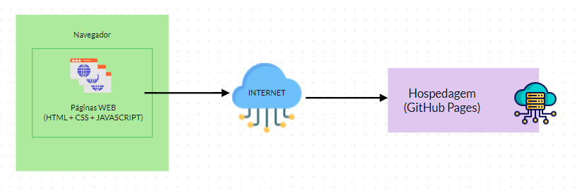
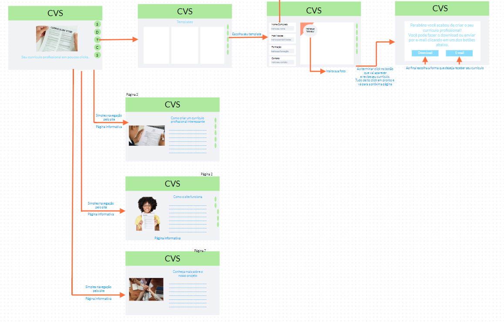

# Arquitetura da Solução

Pré-requisitos: <a href="3-Projeto de Interface.md"> Projeto de Interface</a>

Definição de como o software é estruturado em termos dos componentes que fazem parte da solução e do ambiente de hospedagem da aplicação.

## Diagrama de componentes

Diagrama que permite a modelagem "física" de um sistema, através da visão dos seus componentes e relacionamentos entre os mesmos.

Exemplo: 

Os componentes que fazem parte da solução são apresentados na Figura 12.

Figura 12 - Arquitetura da Solução

A solução implementada conta com os seguintes módulos:
- **Navegador** - Interface básica do sistema  
  - **Páginas Web** - Conjunto de arquivos HTML, CSS, JavaScript e imagens que implementam as funcionalidades do sistema.
    - **Hospedagem** - local na Internet onde as páginas são mantidas e acessadas pelo navegador. 

A imagem a seguir ilustra o fluxo do usuário em nossa solução. Assim
que o usuário entra na plataforma, ele é apresentado à home page
(Tela 1) onde é apresentando o site.

Caso ele opte por construir um currículo profissional ele deve seguir para a página de templates e escolher o que mais lhe agrade, seguir para a página de criação para assim inserir os dados necessários para a criação do currículo. Ao término do processo lhe será dado a opção de revisar o currículo, ali pode conferir se tudo está correto, se tudo estiver correto ele poderá passar para a próxima página onde deverá escolher entre fazer o download ou enviar o currículo via email.

O usuário poderá optar por navegar pelo site e conferir as páginas que ensinam como o site funciona, dicas de como montar seu currículo e/ou para conhecer mais sobre o projeto.

 Figura 12 - Passo a Passo

## Tecnologias Utilizadas 

As tecnologias que serão utilizadas serão as liguagens HTML, CSS e JavaScript, com o intuito de criar uma página dinâmica e de fácil acesso a todos.

## Hospedagem

A hospedagem será feita no GitHub Pages, com link direto do GitHub.

