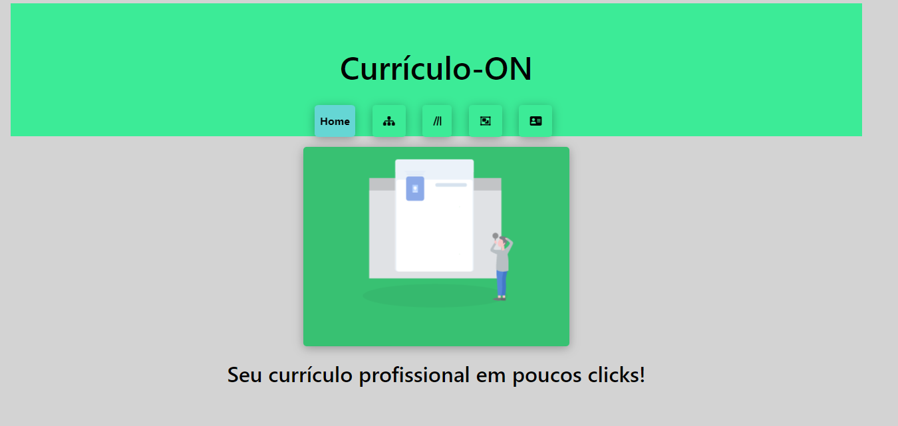
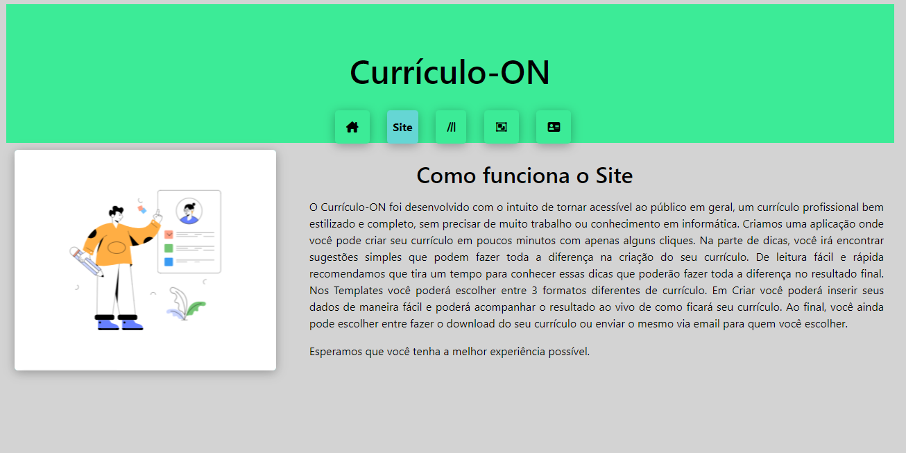
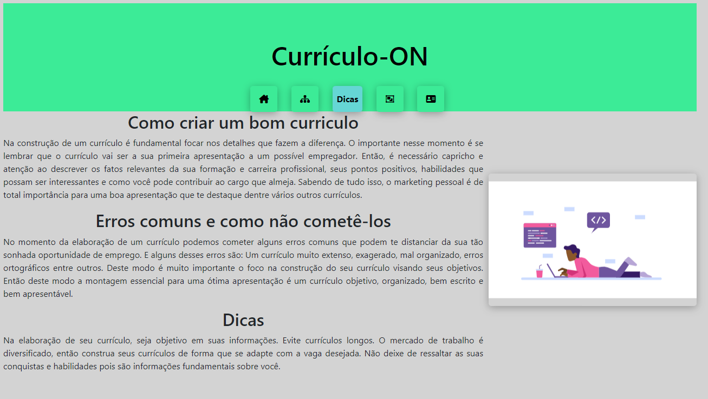
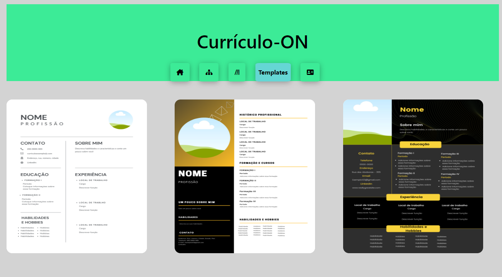
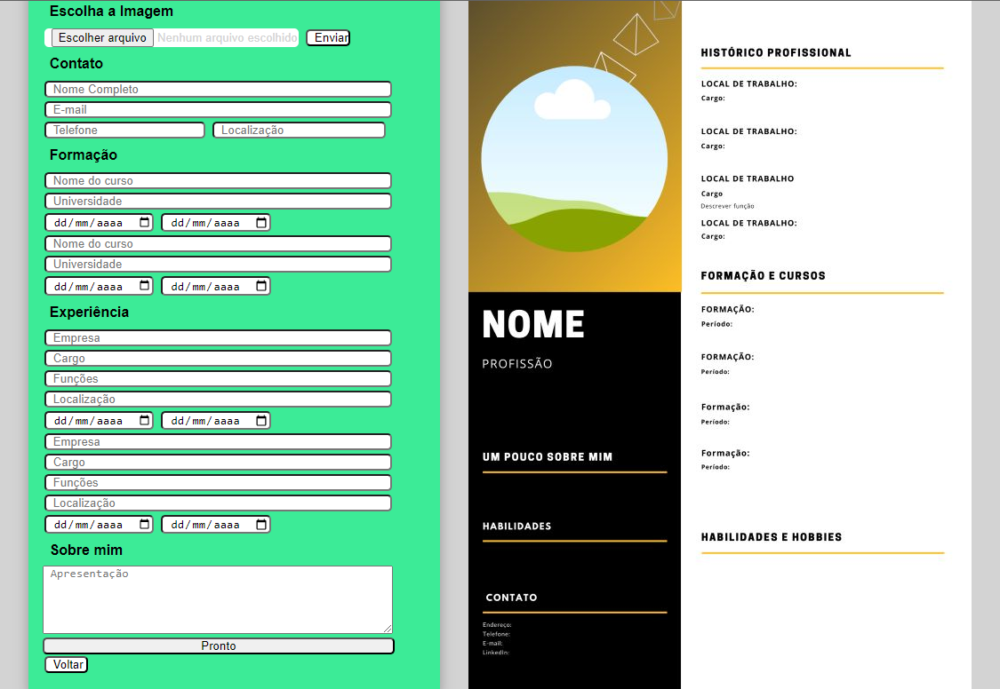
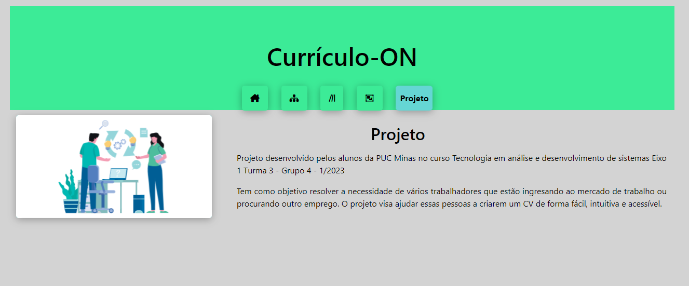

# Template do Site

O template criado está disponível no site http://github.com/…  e é composto pelos seguintes layouts:  
Tela Home
Tela do site
Tela de dicas
Templates
Tela de inserção de dados

A responsabilidade segue o padrão do Bootstrap. (Rever_Linha)

Página inicialtela inicial 

Tela de informe do site 

Neste modelo, são apresentados os principais motivos que levaram à criação desta aplicação de currículos online. Entre eles, destacam-se a facilidade de uso, a personalização dos modelos, a eficiência na criação de um currículo atrativo e a disponibilidade de diversas ferramentas e recursos para auxiliar na busca por uma vaga de emprego. 

dicas 

Nesta etapa, são apresentados os erros mais frequentes na elaboração de um currículo, acompanhados de dicas para evitá-los e do melhor caminho a ser seguido para a sua criação.

Modelos 

Neste espaço, o usuário pode explorar diferentes estilos de currículo e escolher aquele que melhor-se adequa às suas experiências, habilidades e objetivos profissionais.

Tela de inserção de dados 

Neste espaço, é importante incluir todas as informações relevantes para a elaboração de um currículo completo e efetivo, destacando as habilidades, experiências e participação do candidato de forma clara e objetiva.

Projeto 

Desenvolvimento turma_3 - Grupo_4 - Projeto CVO, PUC MINAS 2023.
