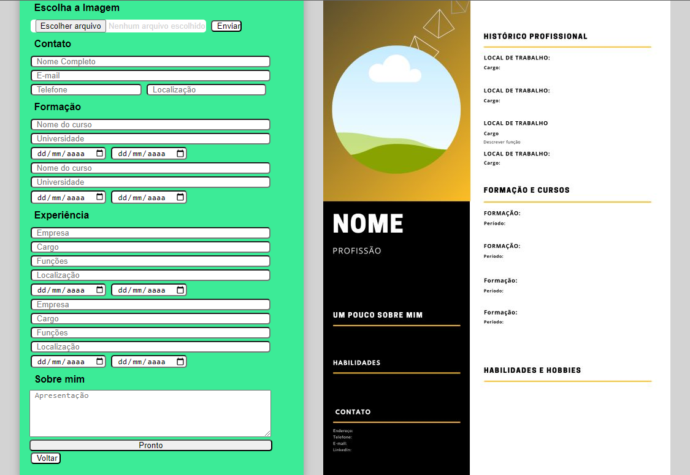

# Programação de Funcionalidades

Nesta seção são apresentadas as telas desenvolvidas para cada uma das funcionalidades
do sistema. O respectivo endereço (URL) e outras orientações de acesso são são
apresentadas na sequência.
Visualização dõ site e dicas (RF-003 )
A tela principal tem uma chamada para o facilidade que o site propõe, em ser simples montar seu CV. A segunda página ,traz uma síntese de como o site funciona. E na página 3 se encontram dicas para facilitar na montagem do CV.

Requisitos atendidos
  - RF-003
  - RF-007
  
Artefatos de funcionalidade
  - index.html
  - app.js
  - style.scss
 

 

O menu interativo e funcional (RF-007)
O menu interativo é fixo em todas as páginas principais, facilitando a navegação entre elas. E na página de criação do CV, existe a opção de voltar e reiniciar o projeto.

Requisitos atendidos
  - RF-007
  - RF-005

Artefatos de funcionalidade
  - template.html
  - template2.html
  - template3.html
  

  
Instruções de acesso
3. Faça o download do arquivo do projeto (ZIP) ou clone do projeto no GitHub;
4. Descompacte o arquivo em uma pasta específica;
5. Abra o Visual Studio Code e execute o Live Server;
6. Abra um navegador de Internet e informe a seguinte URL:
http://localhost:5500/index.html

